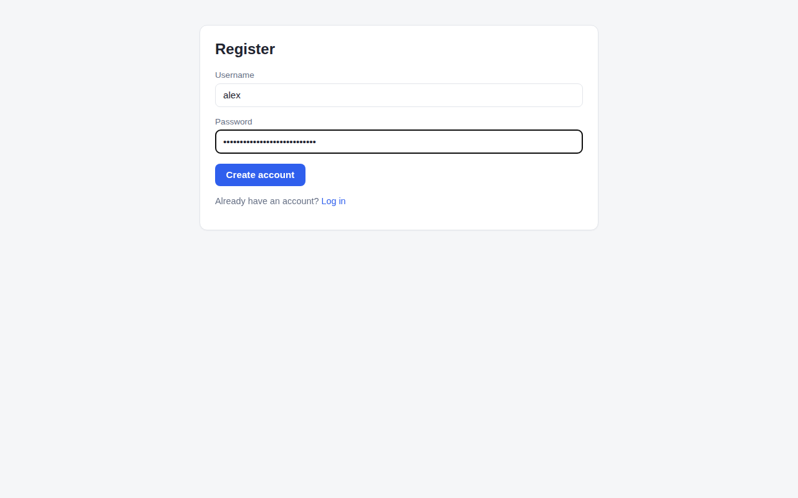
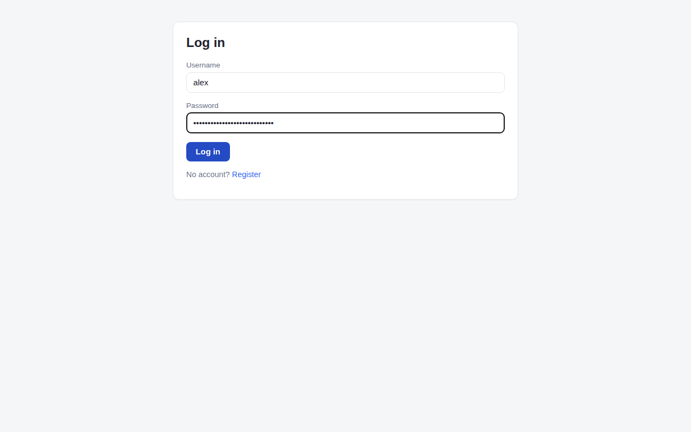
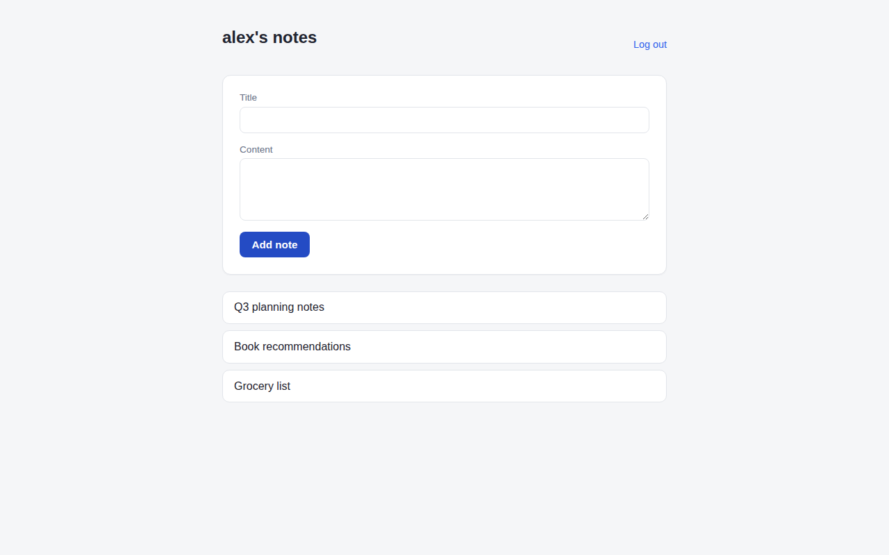
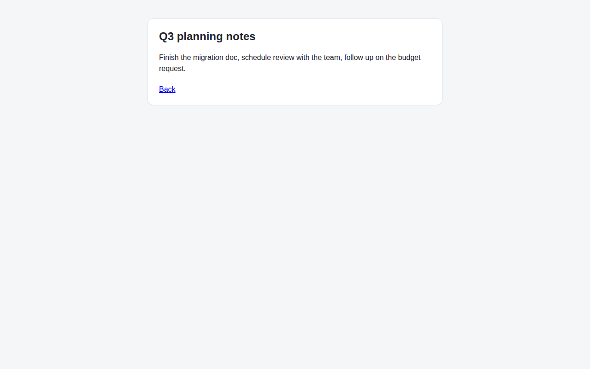

# Flagship 1: Application Security Pipeline

A small notes app with user registration, login, and per-user notes, built in three
passes:

- The [`v1` tag](../../releases/tag/v1) is the original working app with seven OWASP
  Top 10 (2021) issues deliberately seeded into it, each marked with a `VULN` comment at
  the vulnerable line.
- The default branch fixes every one of them, with a short exploit-and-fix writeup per
  vulnerability in [`docs/vulnerabilities/`](docs/vulnerabilities/README.md), including
  real before/after output for each exploit.
- A CI pipeline (`.github/workflows/security.yml`) runs SAST (Bandit plus a small
  project-specific Semgrep ruleset), SCA (`pip-audit`), and DAST (an OWASP ZAP baseline
  scan) on every push and pull request. See
  [`docs/ci-pipeline.md`](docs/ci-pipeline.md) for what each stage catches, including
  what it misses and why the other two stages are still needed.

## Methodology

This project has two separate discovery paths, and they're kept distinct on purpose
rather than blended into one generic "found vulnerabilities" story:

1. **Seed, exploit, fix.** Seven bugs, one per OWASP Top 10 (2021) category, were
   written into the `v1` baseline on purpose, each marked with a `VULN` comment at the
   vulnerable line. Each one was then exploited for real against the running app
   (`docs/vulnerabilities/` has the actual commands and output, not a description of
   what an attacker "could" do), fixed, and re-exploited against the fixed code to
   confirm the fix holds. Where a static analysis tool could plausibly have caught the
   bug, that's noted below; where none of them can, that's noted too, since knowing the
   limits of your own tooling is part of the point of this project.
2. **Build the pipeline, then fix what it actually finds.** Once `.github/workflows/security.yml`
   was running for real on GitHub, it surfaced issues that were never part of the seeded
   list: missing security headers, a missing CSRF token, cookie flags, CSP directives
   with no `default-src` fallback. These weren't planted, they were genuine gaps that a
   real OWASP ZAP scan found by crawling the running app, and they took four failed CI
   runs to fully clear. `docs/ci-pipeline.md` has the real WARN-NEW findings and
   screenshots from each run, including the one CSP rule that took two separate attempts
   to fully satisfy because it doesn't fall back to `default-src` the way most directives
   do.

## Vulnerabilities found and fixed

| # | Vulnerability | OWASP category | How it was found | Fix |
|---|---|---|---|---|
| 1 | [IDOR on note access](docs/vulnerabilities/01-idor-note-access.md) | A01 Broken Access Control | Manual review. A missing ownership check is a logic gap, not a pattern any SAST tool scans for. | Scope the note lookup query to `WHERE id = ? AND owner_id = ?`. |
| 2 | [Plaintext password storage](docs/vulnerabilities/02-plaintext-passwords.md) | A02 Cryptographic Failures | Manual review. There's no unsafe function call to flag, just a hashing step that's absent. | Hash with `werkzeug.security.generate_password_hash`, verify with `check_password_hash`. |
| 3 | [SQL injection in login](docs/vulnerabilities/03-sql-injection-login.md) | A03 Injection | Bandit (`B608`) out of the box, confirmed with a custom Semgrep taint-mode rule that also catches the query being built and executed in different statements. | Parameterized query instead of an f-string. |
| 4 | [Stored XSS in note content](docs/vulnerabilities/04-stored-xss-notes.md) | A03 Injection | Manual review of the Jinja `\| safe` filter, then encoded as a custom Semgrep rule (`jinja-unsafe-filter`) so it can't silently come back. | Removed the `\| safe` filter and let Jinja2's default autoescaping run. |
| 5 | [Hardcoded SECRET_KEY and debug mode](docs/vulnerabilities/05-hardcoded-secret-and-debug-mode.md) | A05 Security Misconfiguration | Bandit (`B105`) caught the hardcoded key, but missed `debug=True` entirely because this app uses the factory pattern (`app = create_app()`), which is outside Bandit's `B201` check. A custom Semgrep rule closes that gap. | Key now comes from an environment variable (or a random one at startup); debug mode is off unless `FLASK_DEBUG=1` is set explicitly. |
| 6 | [Outdated Werkzeug and Flask (multiple CVEs)](docs/vulnerabilities/06-outdated-werkzeug-cve.md) | A06 Vulnerable and Outdated Components | `pip-audit` (SCA). Went in looking for one known CVE and it turned up 22 advisories across both packages. | Bumped to `Flask==3.1.3` and `Werkzeug==3.1.6`; zero code changes needed. |
| 7 | [Insecure YAML deserialization](docs/vulnerabilities/07-insecure-yaml-deserialization.md) | A08 Software and Data Integrity Failures | Bandit (`B506`), confirmed with a custom Semgrep rule. | Switched `yaml.load(..., Loader=yaml.Loader)` to `yaml.safe_load(...)`. |

Two of the seven (IDOR, plaintext passwords) are exactly the kind of bug that no SAST
tool can see, since both are a missing control rather than a dangerous pattern that's
present. That gap is the actual argument for `docs/vulnerabilities/` existing at all,
rather than treating a green CI pipeline as proof the app is secure.

## Screenshots

| Register | Log in |
|---|---|
|  |  |

| Notes list | Note detail |
|---|---|
|  |  |

## Running it locally

```
python3 -m venv venv
./venv/bin/pip install -r requirements.txt
./venv/bin/python run.py
```

Then visit `http://127.0.0.1:5000/register` to create an account.

## Running the security checks locally

```
./venv/bin/pip install -r requirements-dev.txt
./venv/bin/bandit -r . -x ./venv
./venv/bin/semgrep --config security/semgrep-rules.yaml . --exclude venv
./venv/bin/pip-audit -r requirements.txt
```
