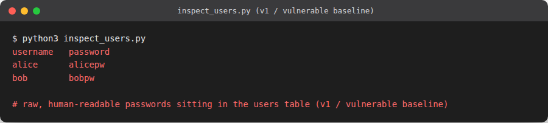
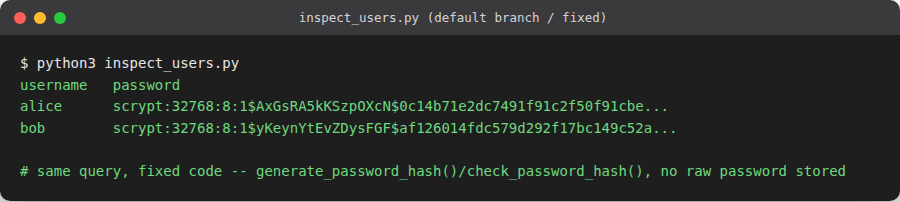

# Plaintext password storage

**OWASP category:** A02:2021 Cryptographic Failures
**CWE:** CWE-256 Plaintext Storage of a Password
**Location:** `app/models.py` (`create_user`)

## The vulnerability

Registration wrote the password the user typed straight into the `users` table with no
hashing at all:

```python
def create_user(username, password):
    conn = get_db()
    conn.execute("INSERT INTO users (username, password) VALUES (?, ?)", (username, password))
    conn.commit()
    conn.close()
```

Anyone who can read the database file, either directly, through a backup, or through a
different vulnerability (like the SQL injection in this same app), recovers every user's
actual password, not just a hash of it. Since people reuse passwords across sites, this
kind of leak has consequences well beyond this one app.

## Exploit

Register a user, then read the database file directly, no vulnerability needed beyond
having read access to `notes.db`:

```
$ curl -d "username=alice&password=alicepw" http://127.0.0.1:5000/register
$ python3 -c "
import sqlite3
conn = sqlite3.connect('notes.db')
conn.row_factory = sqlite3.Row
for row in conn.execute('SELECT username, password FROM users'):
    print(dict(row))
"
{'username': 'alice', 'password': 'alicepw'}
```

The password is sitting there in the clear.



## Fix

Registration now hashes the password with Werkzeug's `generate_password_hash` (salted
PBKDF2-SHA256), and login checks it with `check_password_hash` instead of comparing raw
strings:

```python
def create_user(username, password):
    conn = get_db()
    password_hash = generate_password_hash(password)
    conn.execute("INSERT INTO users (username, password) VALUES (?, ?)", (username, password_hash))
    conn.commit()
    conn.close()
```

The database never holds anything the original password can be recovered from.

## Verification

```
$ python3 -c "
import sqlite3
conn = sqlite3.connect('notes.db')
conn.row_factory = sqlite3.Row
for row in conn.execute('SELECT username, password FROM users WHERE username=\"alice\"'):
    print(dict(row))
"
{'username': 'alice', 'password': 'scrypt:32768:8:1$AxGsRA5kKSzpOXcN$0c14b71e2dc7491f91c2f50f91cbe404208cc8d3901e2db4568ff0cb29a928e258e618172cb563e5bfba82f919ecae4cb626079d27c91f65eab7cfddf83e0a91'}
```



Login still works normally for the correct password (verified through the app's own
register/login flow), but the stored value is now a salted hash. (Werkzeug's
`generate_password_hash` defaults to scrypt as of the version this app is pinned to;
older Werkzeug versions default to PBKDF2-SHA256 instead. Either is a real, salted KDF,
the point of the fix, not the specific algorithm name.)
