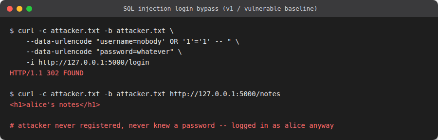
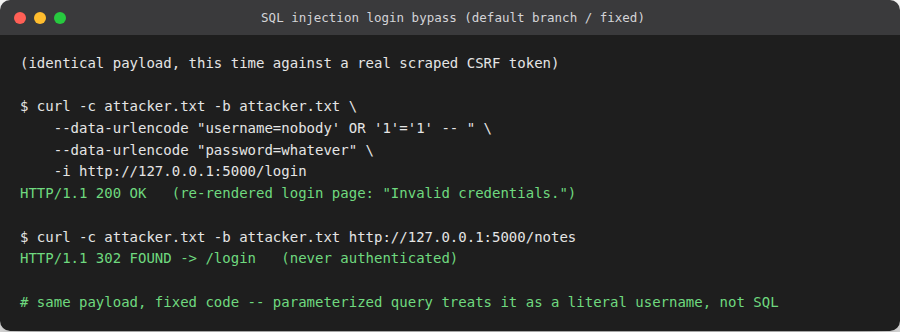

# SQL injection in login (authentication bypass)

**OWASP category:** A03:2021 Injection
**CWE:** CWE-89 SQL Injection
**Location:** `app/models.py` (`find_user_by_credentials`)

## The vulnerability

The login query was built with an f-string instead of parameter placeholders:

```python
def find_user_by_credentials(username, password):
    conn = get_db()
    query = f"SELECT * FROM users WHERE username = '{username}' AND password = '{password}'"
    row = conn.execute(query).fetchone()
    conn.close()
    return row
```

Anything submitted in the `username` or `password` form fields is spliced directly into
the SQL text, so an attacker controls the query, not just its parameters.

## Exploit

An attacker who has never registered logs in as the first user in the table (`alice`)
without knowing her password, by commenting out the rest of the query:

```
$ curl -c attacker.txt -b attacker.txt \
    --data-urlencode "username=nobody' OR '1'='1' -- " \
    --data-urlencode "password=whatever" \
    http://127.0.0.1:5000/login
< HTTP/1.1 302 FOUND

$ curl -c attacker.txt -b attacker.txt http://127.0.0.1:5000/notes
<h1>alice's notes</h1>
```

The resulting query is `SELECT * FROM users WHERE username = 'nobody' OR '1'='1' -- ' AND
password = 'whatever'`. The trailing `--` comments out the password check entirely, `'1'='1'`
is always true, and `fetchone()` returns the first row in the table, alice, logging the
attacker in as her with no valid credentials at all.



A second, unrelated consequence of the same bug: a payload that doesn't close its quotes
cleanly (e.g. a username of `o'brien`) produces malformed SQL and raises an unhandled
`sqlite3.OperationalError`, which is a separate way this bug turns into a crash (see
`05-hardcoded-secret-and-debug-mode.md` for what that crash exposes when debug mode is on).

## Fix

The credential lookup is now split into a parameterized query and a hash check:

```python
def find_user_by_username(username):
    conn = get_db()
    row = conn.execute("SELECT * FROM users WHERE username = ?", (username,)).fetchone()
    conn.close()
    return row

def verify_credentials(username, password):
    user = find_user_by_username(username)
    if user is None:
        check_password_hash(generate_password_hash("dummy"), password)
        return None
    if not check_password_hash(user["password"], password):
        return None
    return user
```

The `?` placeholder means the driver sends the username as data, never as part of the SQL
statement, so there is no way for its contents to change what the query does.

## Verification

```
$ curl -c attacker.txt -b attacker.txt \
    --data-urlencode "username=nobody' OR '1'='1' -- " \
    --data-urlencode "password=whatever" \
    http://127.0.0.1:5000/login
< HTTP/1.1 200 OK   (redisplays the login form with "Invalid credentials.")

$ curl -c attacker.txt -b attacker.txt http://127.0.0.1:5000/notes
< HTTP/1.1 302 FOUND   (redirected to /login, no session was ever created)
```



The same malformed-quote payload (`o'brien`) also no longer crashes the app; it is treated
as a literal, non-matching username.
